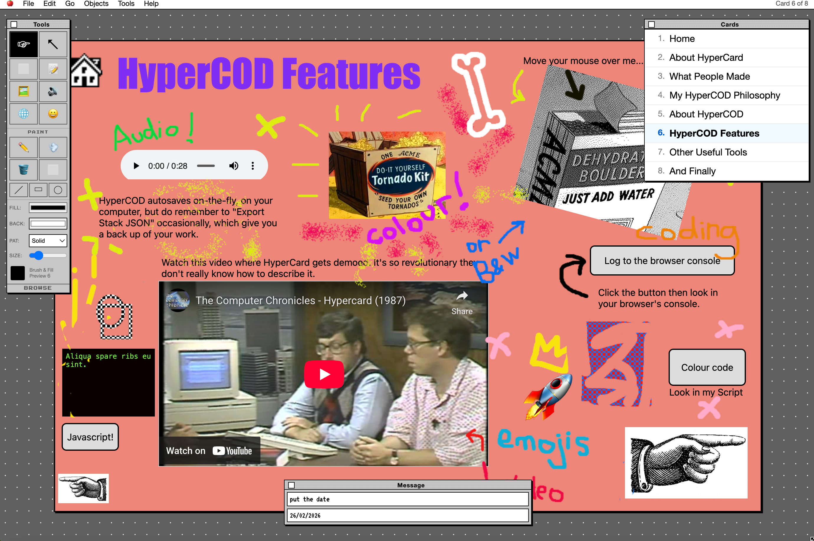
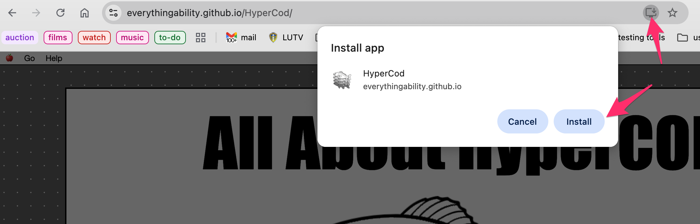

# HyperCod



HyperCod is an interactive platform and English-like scripting language inspired by the classic **HyperTalk**. It allows you to create complex interactions, interactive "stacks," and multimedia applications using a simple, "natural" syntax.

## 🚀 Live Links

*   **[Use HyperCOD](https://everythingability.github.io/HyperCod/)** - Launch the application and start building.
*   **[All About HyperCOD](https://everythingability.github.io/HyperCod/docs/)** - A demo of what it is and what it can do. 

## 📝 What is HyperCod?

HyperCod is designed to be highly readable and accessible. Every script in HyperCod consists of **handlers** that respond to messages like clicking a button or opening a card. 

It brings the spirit of 80s/90s creative computing to the modern web, allowing you to:
*   Navigate through "Cards" in a "Stack".
*   Create interactive buttons and text fields.
*   Use "Natural Language" commands like `go to the next card` or `put "Hello" into field 1`.
*   Add visual effects like dissolves, wipes, and zooms.
*   Integrate directly with JavaScript for advanced functionality.

## 🛠 How to Use HyperCod

1.  **Launch the App**: Open [HyperCOD](https://everythingability.github.io/HyperCod/) in your browser.
2.  **Build Your UI**: Use the interface tools to add buttons, fields, and images to your cards.
3.  **Script Interactions**: Select an object (like a button) and write a script using the HyperCod Language. 
    *   *Example:* 
        ```hypertalk
        on mouseUp
          visual effect "dissolve"
          go to the next card
        end mouseUp
        ```
## Install HyperCod

Note: You can install HyperCod as a PWA (Progressive With Attitude) on your device by clicking the install button in the browser's address bar.



## 🛠 How to Import a Stack

1.  **Launch the App**: Open [HyperCOD](https://everythingability.github.io/HyperCod/) in your browser.
2.  **Import the Stack**: Click the File menu and select "File > Import Stack JSON..." and choose the **All About HyperCOD.json** file.

## Running HyperCod Locally

1.  **Clone the Repository**: `git clone https://github.com/everythingability/HyperCod.git`
2.  **Navigate to the Directory**: `cd HyperCod`
3.  **Run a webserver**: `python -m http.server`
4.  **Open the app**: `http://localhost:8000`

But remember, if you run the PWA, or run it on github pages, or load it from a webserver, your stack content will be stored in the browser's local storage - so may be different from the stack content stored in the browser's local storage when you run it locally. 
---

## 🛠 Developer Links

*   **[Github Repository](https://github.com/everythingability/HyperCod)** - View the source code and contribute. Well that's the idea, but I'm not very good with Github, so maybe download the code, improve it and share it again on here somewhere.


---

© 2026 Tom Smith
